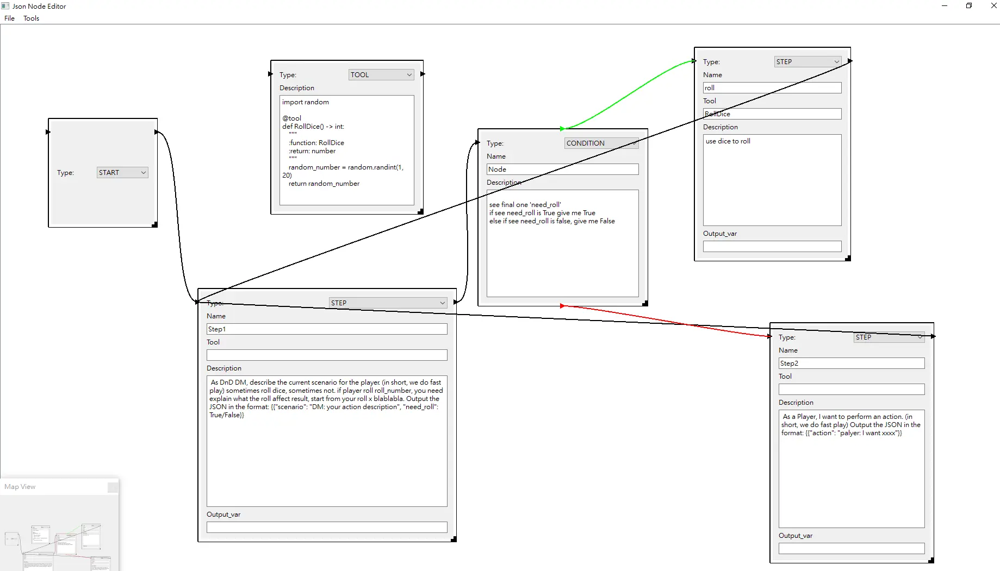
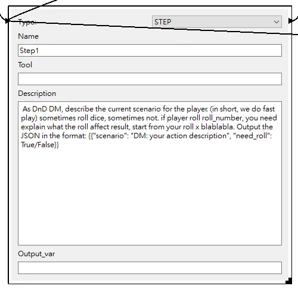
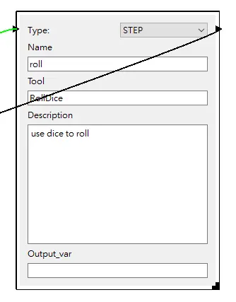
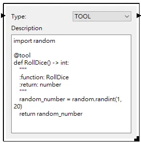

# LangGraph-GUI

LangGraph-GUI is a user-friendly interface for managing and visualizing Node-Edge workflows with LangGraph. It supports creating, editing, and running workflows locally using language models by Ollama .

This is node-edge based gui will export to json as saved graph. To execute json by LangGraph, you need to run [LangGraph-GUI-backend](https://github.com/LangGraph-GUI/LangGraph-GUI-backend)

This repo is implemented with Qt. If you want  ReactFlow version frontend, see [LangGraph-GUI-ReactFlow](https://github.com/LangGraph-GUI/LangGraph-GUI)


*If you want to learn more about LangGraph, we have LangGraph for dummy : [LangGraph-learn](https://github.com/LangGraph-GUI/LangGraph-learn)*



## Explanation

#### Start Node
A graph(json) only have one start node, this will mapping to LangGraph START


#### Step Node
Step Node will mapping to LangGraph add_node, you can drag edge from left node(right port) to right node(left port)



if you drag two node toward to each other, can create cycle.

#### Step Node with tool
Step node fill tool will call function, the tool definition need a tool node



#### Tool Node
Tool node need write real python function code, and need `@tool` decorator like LangChain Custom Tools



#### Contition Node
CONDITION node will mapping to LangGraph conditional_edge

* green edge is true case path
* red edge is false case path


## Environment Setup

### Front-End GUI

To install the required dependencies for the front-end GUI, run:
```bash
pip install PySide6
```


## Running the Application

To start the front-end GUI, execute:
```bash
python main.py
```
This will allow you to read and write JSON files representing DAG workflows for CrewAI.


## Building the Application

To build the front-end GUI into a standalone executable, follow these steps:

1. Install PyInstaller:
    ```bash
    pip install pyinstaller
    ```

2. Navigate to the source directory:
    ```bash
    cd src
    ```

3. Run PyInstaller with the necessary hooks:
    ```bash
    pyinstaller --onefile --additional-hooks-dir=. frontend.py
    ```

